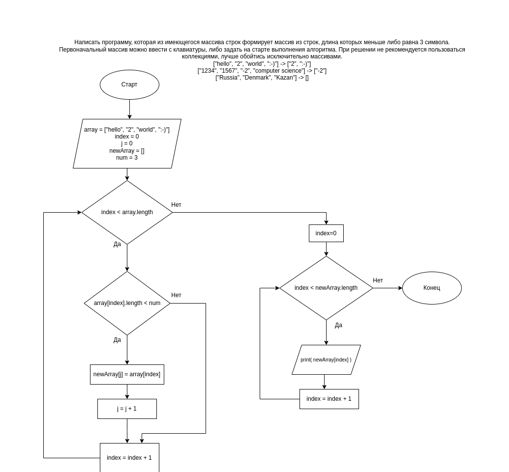

## Итоговая проверочная работа

1. Создать репозиторий на GitHub
2. Нарисовать блок-схему алгоритма (можно обойтись блок-схемойосновной содержательной части, если вы выделяете ее в отдельный метод)
3. Снабдить репозиторий оформленным текстовым описанием решения (файл README.md)
4. Написать программу, решающую поставленную задачу
5. Мспользовать контроль версий в работе над этим небольшим проектом (не должно быть так что все залито одним коммитом, как минимум этапы 2,3 и 4 должны быть расположены в разных коммитах)

**Задача:** 
Написать программу, которая из имеющегося массива строк формирует массив из строк, длина которых меньше либо равна 3 символа. Первоначальный массив можно ввести с клавиатуры, либо задать на старте выполнения алгоритма. При решении не рекомендуется пользоваться коллекциями, лучше обойтись исключительно массивами.

> *Результат:*  
>["hello", "2", "world", ":-)"] -> ["2", ":-)"]  
>["1234", "1567", "-2", "computer science"] -> ["-2"]  
>["Russia", "Denmark", "Kazan"] -> [] 
  

### *Решение*
1. Для всех задач в профиле создан репозиторий GB. Для данной задачи создан раздел Exam.
2. Создана блок-схема с алгоритмом решения

3. Оформлен файл с описанием задачи (Readme.md)
4. 